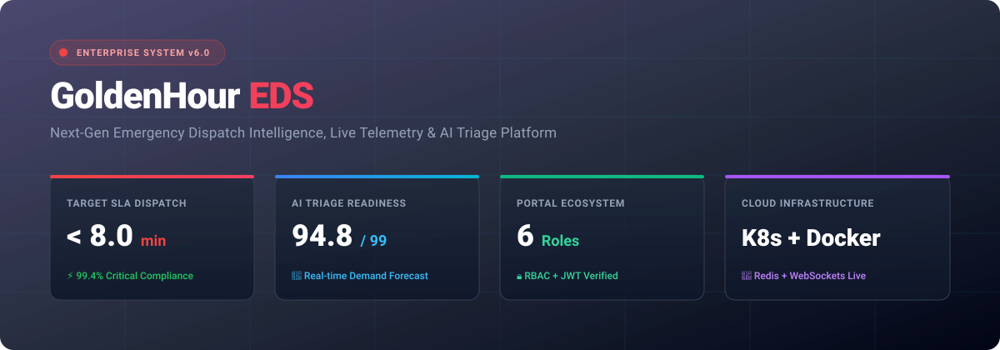
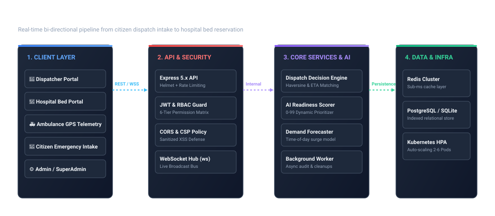
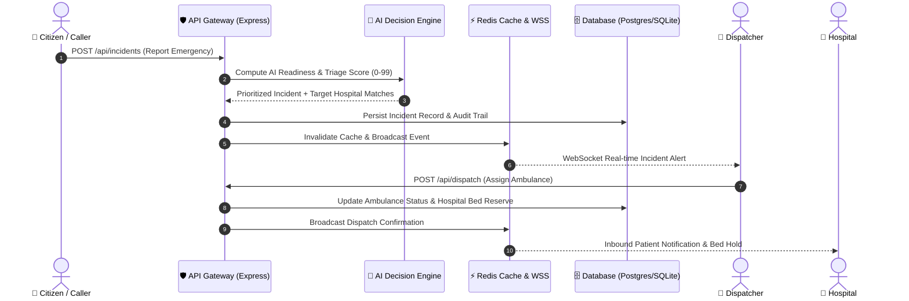

# 🚑 GoldenHour EDS — Emergency Dispatch System

<p align="center">
  
</p>

<p align="center">
  <a href="https://aadil-mansuri0.github.io/goldenhour-eds/"></a>
  <a href="https://github.com/Aadil-Mansuri0/goldenhour-eds/actions/workflows/ci.yml"></a>
  <a href="./LICENSE"></a>
  
  
  
</p>

---

## 🌐 Live Interactive Demo

Experience the full enterprise dispatch intelligence console directly in your browser with zero setup:

### 🔗 **[Launch GoldenHour EDS Live Console](https://aadil-mansuri0.github.io/goldenhour-eds/)**

| Portal / Module | Direct Live Access | Key Functionality |
| :--- | :--- | :--- |
| 🚨 **Command Center** | [Open Dispatcher Portal](https://aadil-mansuri0.github.io/goldenhour-eds/dispatcher-portal.html) | Live GPS incident map, automated ambulance dispatch & AI triage scoring |
| 🏥 **Hospital Network** | [Open Hospital Portal](https://aadil-mansuri0.github.io/goldenhour-eds/hospital-portal.html) | Real-time trauma/ICU bed capacity tracking & intake triage |
| 🚑 **Ambulance Telemetry** | [Open Ambulance Portal](https://aadil-mansuri0.github.io/goldenhour-eds/ambulance-portal.html) | GPS telemetry, crew readiness, battery/fuel, and route ETAs |
| 👤 **Citizen Intake** | [Open Citizen Portal](https://aadil-mansuri0.github.io/goldenhour-eds/citizen-portal.html) | Public emergency reporting interface with instant triage feedback |
| ⚙️ **Analytics & Admin** | [Open Admin Portal](https://aadil-mansuri0.github.io/goldenhour-eds/admin-portal.html) | System SLA compliance, fleet utilization, and audit logs |
| 👑 **Super Admin Governance** | [Open SuperAdmin Portal](https://aadil-mansuri0.github.io/goldenhour-eds/superadmin-portal.html) | Regional dispatch management, cross-jurisdiction oversight |

---

## 📋 Demo Credentials

Login at `http://localhost:3000/` or the live portal with any role:

| Role | Username | Password | Default Portal |
| :--- | :--- | :--- | :--- |
| 🚨 **Dispatcher** | `dispatcher` | `goldenhour@123` | Command Center & Incident Routing |
| ⚙️ **Admin** | `admin` | `admin@golden` | Performance Analytics & Audit Trail |
| 🏥 **Hospital** | `hospital` | `hospital@2026` | Bed & Specialty Capacity Control |
| 🚑 **Ambulance** | `ambulance` | `ambulance@123` | Fleet GPS & Patient Transport |
| 👤 **Citizen** | `citizen` | `citizen@123` | Public Incident Intake |
| 👑 **Super Admin** | `superadmin` | `superadmin@123` | Multi-Region Master Governance |

---

## 🏛️ System Architecture

<p align="center">
  
</p>

### 🔄 End-to-End Emergency Dispatch Sequence



---

## ✨ Features & Capabilities

### 🎯 Real-Time Operational Intelligence
- **Interactive Geospatial Map**: Live Leaflet/OpenStreetMap rendering of emergency incidents, ambulances, and hospital facilities.
- **Dynamic Haversine Routing**: Algorithmic nearest-ambulance discovery and real-time road ETA estimation.
- **AI Readiness Scoring (0-99)**: Automated urgency prioritization combining patient vitals, severity index, and traffic density.
- **Demand Forecasting**: Hourly surge projection model to preemptively position fleet vehicles in high-risk zones.

### 🔐 Security & Hardening
- **JWT Authentication**: Token-based sessions with 8-hour cryptographic expiry.
- **6-Tier RBAC Guard**: Granular permission matrix enforcing role boundaries on every endpoint.
- **Defensive Headers**: Full Helmet configuration, Content Security Policy (CSP), and strict CORS origin validation.
- **Sanitized XSS Defense**: Safe DOM rendering preventing client injection vectors.
- **Rate Limiting**: Configurable sliding-window rate limiters per IP.

### ⚡ Production Architecture
- **Distributed Caching**: Redis cache layer with sub-millisecond response and in-memory TTL fallback.
- **Real-Time WebSocket Bus**: Bi-directional event broadcasting for zero-latency operator synchronization.
- **Dual Database Support**: SQLite for rapid local development and PostgreSQL for enterprise scale.
- **Structured Audit Logging**: JSON-formatted immutable audit trails tracking all dispatch decisions.

---

## 📁 Repository Structure

```
goldenhour-eds/
├── .github/
│   └── workflows/
│       ├── ci.yml                    # Automated Test & Health Check CI Pipeline
│       └── deploy-pages.yml          # Automated GitHub Pages Live Demo Deployment
├── docs/
│   ├── assets/
│   │   ├── banner.svg                # High-resolution Hero Banner
│   │   └── architecture.svg          # System Topology SVG Diagram
│   ├── api.md                        # Complete REST API Reference
│   ├── architecture.md               # Technical Deep-Dive
│   ├── deployment.md                 # Production Cloud & On-Prem Guide
│   ├── er-diagram.md                 # Database Entity Relationship Model
│   └── portal-guide.md               # Multi-Portal Operator Manual
├── k8s/                              # Kubernetes Manifests (Namespace, HPA, Ingress)
│   ├── deployment.yaml
│   ├── service.yaml
│   ├── configmap.yaml
│   └── secret.yaml
├── public/                           # Frontend Applications & Live Demos
│   ├── index.html                    # Interactive Dispatch Intelligence Console
│   ├── dispatcher-portal.html        # Command Center Dashboard
│   ├── hospital-portal.html          # Hospital Capacity Management
│   ├── ambulance-portal.html         # Ambulance Fleet Telemetry
│   ├── citizen-portal.html           # Emergency Reporting Interface
│   ├── admin-portal.html             # Analytics & Audit Trail
│   ├── superadmin-portal.html        # Regional Oversight
│   ├── app.js                        # Client API & Mapping Utilities
│   └── styles.css                    # Shared Design System
├── src/
│   ├── server.js                     # Express API Server & WebSocket Hub
│   ├── auth.js                       # JWT & RBAC Engine (6 Roles)
│   ├── database.js                   # Schema Initialization & Query Helpers
│   ├── config.js                     # Centralized Environment Config
│   ├── logger.js                     # Structured JSON Logger
│   ├── middleware/                   # Error & Security Middlewares
│   └── services/
│       ├── aiService.js              # Readiness Scoring & Predictive Demand
│       ├── dispatchService.js        # Ambulance-Hospital Matching & ETAs
│       ├── redisService.js           # Distributed Cache Service
│       ├── routingService.js         # Multi-Provider Routing Abstraction
│       └── websocketService.js       # Real-Time Broadcast Integration
├── tests/
│   ├── unit/                         # Unit Tests for Services & Auth
│   └── integration/                  # End-to-End API Route Tests
├── Dockerfile                        # Multi-Stage Production Container
├── docker-compose.yml                # Local Dev Stack (App + Redis + DB)
├── package.json                      # Project Dependencies & Scripts
└── README.md                         # Project Documentation
```

---

## 🚀 Quick Start (Local Setup)

### Prerequisites
- **Node.js**: `v18.0.0` or higher
- **npm**: `v9.0.0` or higher
- **Git**: For version control

### 1. Clone & Install
```bash
git clone https://github.com/Aadil-Mansuri0/goldenhour-eds.git
cd goldenhour-eds
npm install
```

### 2. Configure Environment
```bash
cp .env.example .env
```

### 3. Run Test Suite
```bash
npm test
```

### 4. Start Server
```bash
npm start
```
Visit **`http://localhost:3000/`** to view the live dashboard.

---

## 🐳 Docker Deployment

Run the complete production stack (Node.js app + Redis + PostgreSQL) in one command:

```bash
docker-compose up --build
```

Build standalone container image:
```bash
docker build -t goldenhour-eds:latest .
docker run -p 3000:3000 -e NODE_ENV=production goldenhour-eds:latest
```

---

## ☸️ Kubernetes Deployment

Deploy to any Kubernetes cluster (EKS, GKE, AKS, minikube):

```bash
# Apply all Kubernetes manifests
kubectl apply -f k8s/namespace.yaml
kubectl apply -f k8s/

# Verify running pods
kubectl get pods -n goldenhour
```

---

## 🧪 Test Verification

The project includes an automated unit and integration test suite executing 26 comprehensive checks across authentication, Pan-India routing, Manchester clinical triage, voice intent parsing, database persistence, and REST endpoints:

```bash
npm test
```

```text
✔ GET /api/health returns 200 ok with Pan-India network status
✔ GET /api/ready returns 200 ready
✔ GET /api/verify-token verifies authenticated user
✔ GET /api/dashboard returns complete operational summary
✔ POST /api/incidents creates incident and logs audit
✔ POST /api/dispatch executes automated dispatch decision
✔ PATCH /api/hospitals/:id updates bed availability and logs audit
✔ GET /api/hospitals/nearby performs geospatial distance calculations
✔ GET /api/locations/search finds Pan-India city hubs
✔ POST /api/ai/voice-parse extracts emergency nature and patient count
✔ POST /api/ai/triage evaluates Manchester triage clinical urgency
✔ GET /api/audit-logs returns list of system events
✔ GET /api/metrics returns real calculated performance SLAs
✔ GET /api/analytics/regional returns Pan-India aggregated metrics
✔ dispatchService: getDistanceKm returns valid distance for Indian coordinates
✔ dispatchService: estimateEtaKm returns realistic minutes
✔ dispatchService: normalizeSeverity handles various inputs
✔ aiService: scoreDispatchReadiness returns score bounded below 100
✔ aiService: forecastDemand returns integer percent
✔ aiService: evaluateClinicalTriage classifies P1 Resuscitation accurately
✔ aiService: evaluateClinicalTriage classifies P2 Very Urgent cardiac chest pain
✔ aiService: parseVoiceEmergencyInput extracts nature and count
✔ aiService: processAIAssistantQuery answers hospital capacity grounded in context
✔ routingService: buildRoute generates Pan-India emergency corridor payload
✔ auth: verifyPassword authenticates valid demo users
✔ auth: signToken produces JWT string

ℹ tests 26 | pass 26 | fail 0
```

---

## 📄 License

This project is licensed under the MIT License - see the [LICENSE](./LICENSE) file for details.
