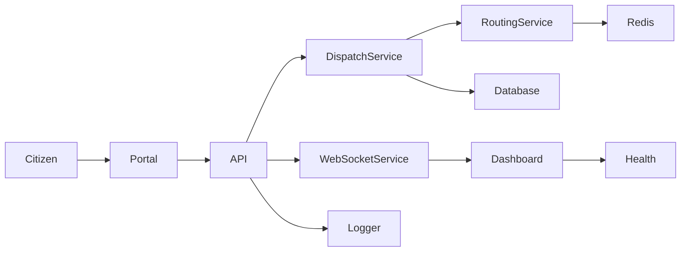

# GoldenHour EDS Architecture

## Overview

GoldenHour EDS is a national-scale emergency dispatch platform built around a modular service architecture, live operational data flow, and role-based portal experiences.

## Components

- Web/API Layer: Express.js API and static portal frontend
- Core services: dispatch, routing, AI scoring, cache, workers
- Data layer: SQLite for local demo, PostgreSQL-ready schema design
- Redis: caching, session support, queueing
- Real-time layer: WebSockets for live fleet and incident updates
- Observability: structured logs, health checks, readiness probes

## Flow

1. Incident is created by a citizen or dispatcher.
2. Dispatch service evaluates severity and nearest resources.
3. Routing service computes ETA and route optimization.
4. Workers process alerts and notifications.
5. WebSocket stream broadcasts updates to connected clients.
6. Health and readiness endpoints expose service status to operations.

## Diagram

