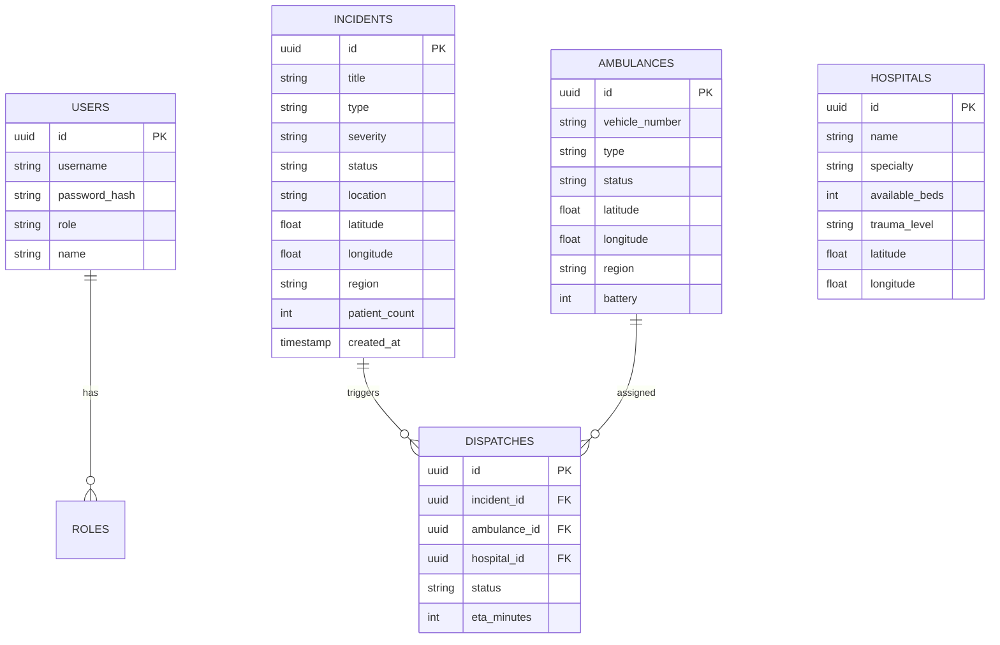

# ER Diagram

```mermaid
erDiagram
  USERS ||--o{ ROLES : has
  USERS {
    uuid id PK
    string username
    string password_hash
    string role
    string name
  }

  INCIDENTS ||--o{ DISPATCHES : triggers
  INCIDENTS {
    uuid id PK
    string title
    string type
    string severity
    string status
    string location
    float latitude
    float longitude
    string region
    int patient_count
    timestamp created_at
  }

  AMBULANCES ||--o{ DISPATCHES : assigned
  AMBULANCES {
    uuid id PK
    string vehicle_number
    string type
    string status
    float latitude
    float longitude
    string region
    int battery
  }

  HOSPITALS {
    uuid id PK
    string name
    string specialty
    int available_beds
    string trauma_level
    float latitude
    float longitude
  }

  DISPATCHES {
    uuid id PK
    uuid incident_id FK
    uuid ambulance_id FK
    uuid hospital_id FK
    string status
    int eta_minutes
  }
```
