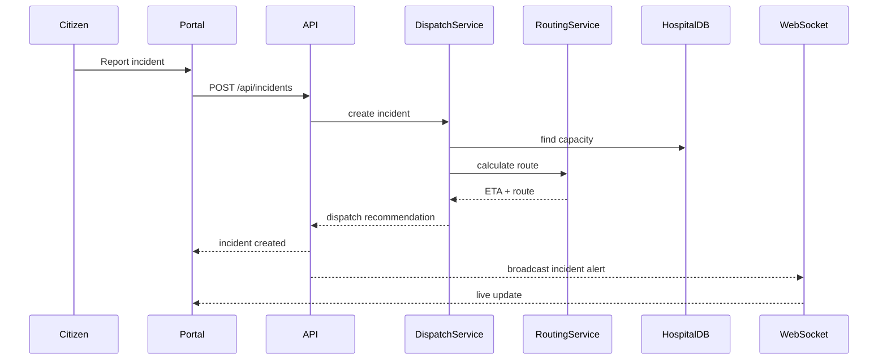

# Sequence Diagram

```mermaid
sequenceDiagram
  participant Citizen
  participant Portal
  participant API
  participant DispatchService
  participant RoutingService
  participant HospitalDB
  participant WebSocket

  Citizen->>Portal: Report incident
  Portal->>API: POST /api/incidents
  API->>DispatchService: create incident
  DispatchService->>HospitalDB: find capacity
  DispatchService->>RoutingService: calculate route
  RoutingService-->>DispatchService: ETA + route
  DispatchService-->>API: dispatch recommendation
  API-->>Portal: incident created
  API-->>WebSocket: broadcast incident alert
  WebSocket-->>Portal: live update
```